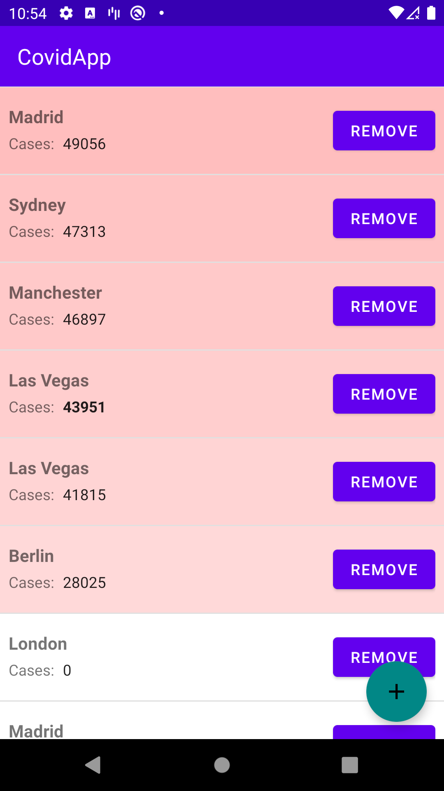
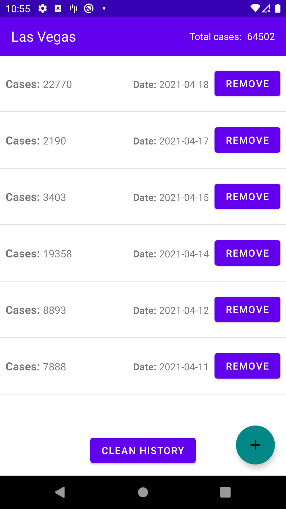

# Covid Application
Simple application to view the registered Covid cases in different cities.

## Demo
 

### Google components used in project
* [ViewModel][10]
* [LiveData][15]
* [DataBinding][14]
* [Room][11]
* [Navigation][12]

[10]: https://developer.android.com/topic/libraries/architecture/viewmodel
[11]: https://developer.android.com/training/data-storage/room/
[12]: https://developer.android.com/guide/navigation/
[14]: https://developer.android.com/topic/libraries/data-binding/
[15]: https://developer.android.com/topic/libraries/architecture/livedata

### Some of 3rd party libs used in project
* [Koin][21]
* [Binding Collection][22]

[21]: https://github.com/InsertKoinIO/koin
[22]: https://github.com/evant/binding-collection-adapter

Developed By
------------

* Adam Szkup | All rights reserved
